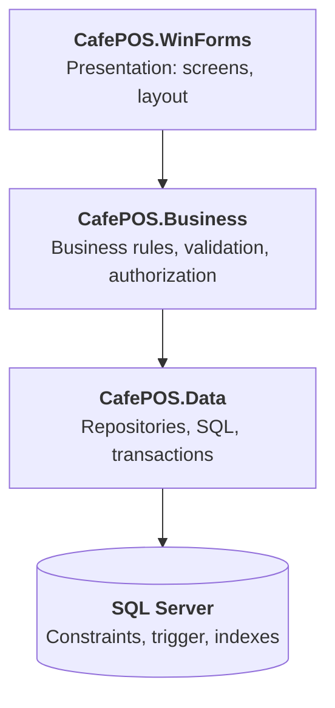

# CafePOS

A point-of-sale system for small coffee shops, built with **C# WinForms** and **SQL Server** using a **three-layer architecture**.


## Features

**Cashier**
- Tap-to-order menu tiles showing live stock; sold-out items lock automatically
- Order cart with quantity adjustment; checkout runs in a single database transaction

**Administrator**
- Menu management: add, edit and discontinue items
- Staff management: create cashier accounts, reset passwords, deactivate accounts
- Revenue reports by item, by day and by staff member
- Audit log of every change to item price, name and availability

**System**
- First-run setup wizard creates the initial administrator
- Database connection configured in `appsettings.json`, no recompilation needed

| Login | Revenue report |
|---|---|
|  |  |

## Tech stack

- C# / .NET 10, Windows Forms
- SQL Server 2022 Express
- ADO.NET with `Microsoft.Data.SqlClient` (hand-written SQL, no ORM)
- PBKDF2-SHA256 password hashing (built into .NET)

## Architecture



- **Dependencies point downward only.** The UI never touches SQL; the data layer never knows about the UI.
- **The UI contains no business rules.** It only displays data and forwards user actions. Every rule ("don't sell beyond stock", "only admins may change prices") lives in the business layer, so a future web or mobile client would reuse them unchanged.
- **Errors are translated between layers.** The data layer raises technical errors (e.g. `KhongDuHangException`); the business layer converts them into user-facing messages (`LoiNghiepVu`).
- **`Program.cs` is the composition root**: the single place allowed to know every layer. It reads configuration and wires the layers together at startup.

## Engineering decisions

**1. Checkout is atomic.**
Creating the invoice, deducting stock for each item, writing invoice lines and computing the total all run inside one SQL transaction. If any step fails, everything rolls back. There is never a half-written invoice or incorrectly deducted stock.

**2. Two cashiers cannot sell the last item twice.**
Stock is deducted with a single conditional statement, `UPDATE ... SET Stock = Stock - @Qty WHERE Id = @Id AND Stock >= @Qty`, instead of "read stock, check, then write". The losing transaction affects 0 rows and rolls back. A `CHECK (Stock >= 0)` constraint is the last line of defence. *Verified by running two app instances against the same database.*

**3. Prices are never taken from the client.**
The checkout request contains only item IDs and quantities. Unit prices are copied from the database inside the transaction, and totals are computed with `SUM` in SQL.

**4. Historical prices are preserved.**
Each invoice line stores the unit price at the time of sale, so changing a menu price never rewrites past revenue.

**5. Soft delete.**
Discontinued items and departed staff are flagged, not deleted, because past invoices still reference them.

**6. SQL injection.**
Every user-supplied value is passed as a typed parameter. *Demonstrated by deliberately writing a vulnerable version, exploiting it (`x'; UPDATE Mon SET GiaBan = 0; --`), then removing it.*

**7. Password storage.**
PBKDF2-SHA256 with 600,000 iterations and a random 16-byte salt per user; constant-time comparison. Login failures return one generic message and take the same time whether or not the username exists, so usernames cannot be enumerated.

**8. Authorization is enforced in the business layer, not just the UI.**
Admin-only buttons are hidden for cashiers as a convenience, but every privileged service method starts with `PhienDangNhap.YeuCauAdmin()`. *Verified by un-hiding the buttons for a cashier: all privileged actions were still rejected.*

**9. Audit log that cannot be bypassed.**
A SQL trigger records old and new values whenever an item's price, name or availability changes, including changes made directly in SSMS. The app tags each connection with the logged-in employee via `SESSION_CONTEXT`, so the trigger knows *who* made the change. The trigger uses `SET NOCOUNT ON` so its own inserts don't alter the affected-row counts the application relies on.

**10. Indexes, measured.**
Reports filter invoices by date. With 100,000 generated invoices, the "last 7 days by item" report:

| | Logical reads (invoices) | Logical reads (invoice lines) | Plan |
|---|---|---|---|
| Without indexes | 609 | 771 | Clustered Index Scan |
| With indexes | 16 | 3 | Index Seek |
The date index cuts pages read on the invoice table by about **19×**.

Date filters are written as `CreatedAt >= @From AND CreatedAt < @To` (never `CAST(CreatedAt AS DATE) = ...`) so the index can be used.

## Project structure

```
CafePOS
├── CafePOS.WinForms      Presentation layer
├── CafePOS.Business      Business layer
│   ├── BaoMat            Password hashing, login session, authorization
│   ├── Models            Cart, checkout result, report bundle
│   └── Services
├── CafePOS.Data          Data layer
│   ├── Models
│   └── Repositories
├── Database              SQL scripts (run in numeric order)
└── docs/images           Screenshots
```

## Getting started

**Requirements:** Windows 10/11, SQL Server 2022 Express (or later), SQL Server Management Studio.

1. **Create the database.** In SSMS, run the scripts in `Database/` in this order:
   `01_TaoDatabase.sql` → `03_NhatKyMon.sql` → `04_Index.sql`
   (`90_`/`91_` generate and remove test data for performance testing; don't run them on real data.)
2. **Configure the connection.** Edit `CafePOS.WinForms/appsettings.json` if your SQL Server instance is not `.\SQLEXPRESS`.
3. **Run.** Open `CafePOS.slnx` in Visual Studio and press F5. On first run, a setup wizard asks you to create the administrator account.

**Publish a self-contained build** (runs on machines without .NET installed):

```
dotnet publish .\CafePOS.WinForms\CafePOS.WinForms.csproj -c Release -r win-x64 --self-contained true -o .\publish\CafePOS
```

## Known limitations and next steps

- **Unit tests cover the cart and password hashing** (`CafePOS.Tests`, xUnit). Service-level tests need repository interfaces, which is the next refactoring step.
- **Manual database setup.** A production version would use database migrations and an installer.
- **Session state is static.** Fine for a single-user desktop app; a web API would carry identity per request.
- **Invoice numbers use `IDENTITY`**, which leaves gaps after rolled-back transactions. Legally sequential invoice numbering would need a separate sequence.
- **Single store only.** Multiple stores would require a web API in front of the database and per-store data isolation.
- **Discontinued items can only be restored via SQL**; a "restore item" screen is planned.